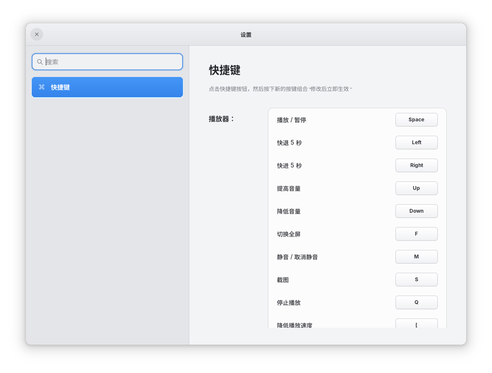

<div align="center">

# 🎬 VMedia 原生播放器

**基于 Rust 构建的现代、轻量级原生视频播放器**

[](https://www.rust-lang.org/)
[](https://gtk.org/)
[](https://mpv.io/)
[](#许可证)

[中文](#概述) · [English](README.md)

---



</div>

## 概述

VMedia 是一款 Linux 原生视频播放器，结合了 **libmpv** 强大的解码能力与 **GTK4 + Libadwaita** 现代化的界面框架。它提供简洁极致的使用体验：悬浮毛玻璃控制面板、硬件加速视频渲染、智能播放恢复。

## ✨ 功能特性

### 🎥 播放功能
- **硬件加速渲染** — 基于 `libmpv` render API 的 OpenGL 视频输出
- **广泛格式支持** — 支持 ffmpeg/mpv 所有格式（MP4、MKV、AVI、WebM、FLAC、MP3 等）
- **播放速度控制** — 0.25x ~ 3.0x，快捷速度选择器
- **智能续播** — 记住播放位置，下次启动自动恢复
- **精确跳转** — 点击或拖动进度条；快捷键 ±5秒 / ±30秒 跳转

### 🎛️ 控制面板
- **悬浮毛玻璃面板** — 半透明模糊背景，圆角设计
- **自动隐藏** — 鼠标停止移动 1.5 秒后隐藏，移动鼠标即刻显示
- **可拖动** — 控制栏可拖动到屏幕任意位置
- **响应式宽度** — 自动缩放至窗口宽度的 60%，最大不超过 600px
- **圆形播放按钮** — 极简设计，平滑悬停效果

### ⌨️ 快捷键设置
- **可视化配置** — IINA 风格的独立快捷键设置窗口
- **即时生效** — 点击快捷键按钮即可录入新的单键或组合键
- **冲突检测** — 自动阻止重复绑定，支持清除和恢复默认
- **持久保存** — 自定义快捷键会在重新启动后继续生效

### 🔊 音量控制
- **音量滑块** — 鼠标悬停音量图标时弹出竖向滑块
- **5 级音量图标** — 直观反馈：静音、25%、50%、75%、100%
- **静音切换** — 点击音量图标或按 `M` 键

### 📂 播放列表
- **自动填充** — 打开文件后自动扫描同目录下的所有媒体文件
- **全高面板** — 从右侧滑出，半透明背景
- **高亮当前** — 正在播放的文件高亮显示
- **双击播放** — 双击列表项无缝切换

### 💾 数据持久化
- **记住上次文件** — 重新打开时自动加载上次播放的视频（暂停状态）
- **位置记忆** — 每 5 秒自动保存播放进度
- **播放列表恢复** — 自动恢复上次的播放列表

## 🏗️ 项目架构

```
native-player/src/
├── main.rs                    # 程序入口
├── app.rs                     # 应用生命周期与事件循环
├── core/                      # 核心逻辑层
│   ├── command.rs             # 命令枚举（打开文件、跳转、暂停等）
│   ├── event.rs               # 事件枚举（状态变更通知）
│   ├── models.rs              # 数据模型（MediaInfo）
│   └── state.rs               # 应用状态（AppState）
├── player/                    # 播放器后端
│   ├── libmpv.rs              # libmpv FFI 封装
│   ├── mpv_controller.rs      # 命令 → mpv 指令翻译
│   ├── mpv_events.rs          # mpv 事件 → AppEvent 翻译
│   └── playback_state.rs      # 播放状态追踪
├── infra/                     # 基础设施层
│   ├── config.rs              # 应用配置
│   ├── db.rs                  # 数据库（预留）
│   ├── logging.rs             # 日志初始化
│   ├── playback_history.rs    # JSON 持久化（位置 + 上次文件）
│   ├── shortcut_settings.rs   # 快捷键配置与持久化
│   └── xdg.rs                 # XDG 目录路径
└── ui/                        # 界面层
    ├── style.css              # 完整 UI 主题（毛玻璃、暗色模式）
    ├── window.rs              # 窗口设置、快捷键、自动隐藏、拖动逻辑
    ├── player_view.rs         # 主视图（叠加层、GLArea、控件）
    └── widgets/               # 组件
        ├── player_controls.rs # 控制栏组装
        ├── seek_bar.rs        # 自定义进度条（支持拖动感知）
        └── playlist_panel.rs  # 右侧滑出播放列表
```

### 架构设计

```
┌─────────────┐    命令     ┌──────────────┐    FFI    ┌─────────┐
│   UI 层     │ ────────▶  │ MpvController │ ──────▶  │  libmpv  │
│  (GTK4)     │            │              │          │         │
│             │ ◀────────  │              │ ◀──────  │         │
└─────────────┘    事件     └──────────────┘  回调     └─────────┘
       │                          │
       ▼                          ▼
 ┌───────────┐            ┌─────────────┐
 │ AppState  │            │  PlaybackHistory │
 │ (状态管理) │            │  (JSON 持久化)   │
 └───────────┘            └─────────────────┘
```

**数据流：** 用户操作 → `AppCommand` → `MpvController` → `libmpv` → `AppEvent` → `AppState` → UI 重新渲染

## 📦 依赖说明

| 依赖 | 用途 |
|---|---|
| `gtk4` (0.10) | UI 框架 |
| `libadwaita` (0.8) | 自适应布局、暗色主题 |
| `libmpv` | 视频/音频解码与渲染 |
| `serde` + `serde_json` | 播放历史持久化 |
| `tracing` | 结构化日志 |

### 系统要求

- **操作系统**：Linux（X11 / Wayland）
- **GTK**：≥ 4.10
- **Libadwaita**：≥ 1.4
- **libmpv**：≥ 0.36
- **Rust**：2024 Edition（≥ 1.85）

## 🚀 快速开始

### 安装系统依赖

**Fedora / RHEL：**
```bash
sudo dnf install gtk4-devel libadwaita-devel mpv-libs-devel
```

**Ubuntu / Debian：**
```bash
sudo apt install libgtk-4-dev libadwaita-1-dev libmpv-dev
```

**Arch Linux：**
```bash
sudo pacman -S gtk4 libadwaita mpv
```

### 编译运行

```bash
cd native-player
cargo run
```

### 打开视频文件

```bash
# 命令行直接打开
cargo run -- /path/to/video.mp4
```

或者使用控制面板中的 **文件夹图标** 打开文件选择对话框。

## ⌨️ 快捷键

| 按键 | 功能 |
|---|---|
| `Space` （空格） | 播放 / 暂停 |
| `←` / `→` | 快退/快进 5 秒 |
| `↑` / `↓` | 音量 ±5% |
| `M` | 静音切换 |
| `F` | 全屏切换 |
| `S` | 截图 |
| `Q` | 停止播放 |
| `[` / `]` | 降低/提高播放速度 |
| `Ctrl+O` | 打开文件 |
| `P` | 显示/隐藏播放列表 |
| `Ctrl+,` | 打开快捷键设置 |
| `Esc` | 退出全屏 |

## 📁 数据存储

播放历史保存在：
```
~/.local/share/vmedia/playback_history.json
```

文件格式示例：
```json
{
  "positions": {
    "/home/user/视频/电影.mp4": 1234.5
  },
  "last_media": "/home/user/视频/电影.mp4"
}
```

## 🗺️ 开发路线图

- [x] 核心播放（播放、暂停、跳转、音量）
- [x] 悬浮毛玻璃控制面板 + 自动隐藏
- [x] 可拖动控制栏
- [x] 播放列表面板
- [x] 播放恢复与持久化
- [ ] 字幕管理（外挂字幕加载、延迟调整）
- [ ] 音轨切换
- [ ] A-B 循环播放
- [x] 截图功能
- [ ] 媒体库（海报墙缩略图）
- [x] 快捷键设置与自定义绑定
- [ ] 主题设置

## 🤝 参与贡献

1. Fork 本仓库
2. 创建功能分支：`git checkout -b feature/amazing-feature`
3. 提交代码：`git commit -m 'feat: 添加某个功能'`
4. 推送分支：`git push origin feature/amazing-feature`
5. 发起 Pull Request

## 📄 许可证

本项目基于 MIT 许可证开源 — 详见 [LICENSE](LICENSE) 文件。

---

<div align="center">
  <sub>使用 ❤️ + Rust + GTK4 + libmpv 精心打造</sub>
</div>
